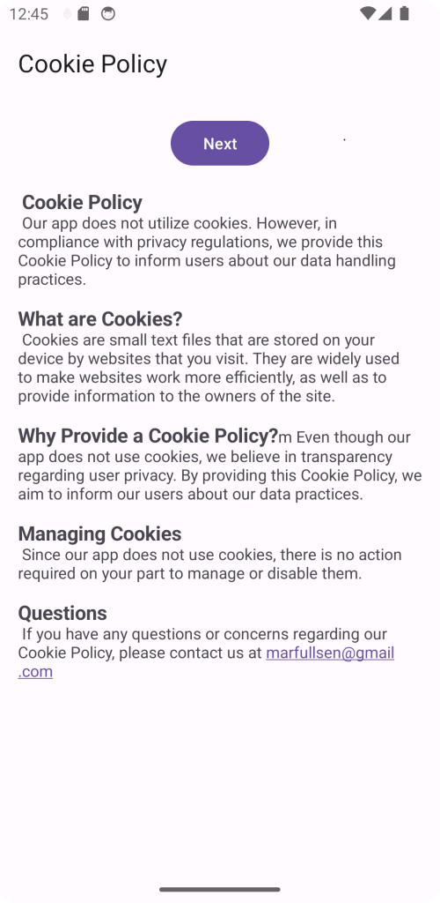
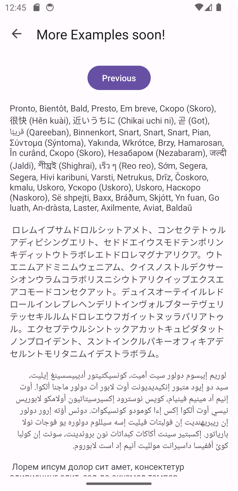

    

# Cookie Policy Examples

  Catálogo de Pop-ups de ejemplo para acordar el uso de Cookies en aplicaciones móviles.

## ¿Qué es esta aplicación?
Actualmente el mercado requiere que las aplicaciones y sitios web se ajusten a las políticas de cookies, *incluso si no las usan*, es por eso que este catálogo permite a los desarrolladores poder tantear entre diferentes modelos sobre la política de cookies que decida el usuario final.

## ¿Es posible descargar esta aplicación en GooglePlay?
Lamentablemente ya no es posible, la aplicación estuvo disponible por un par de días en Google Play Store pero fue retirada debido a razones injustas con respecto a la cuenta de desarrollador, según informó Google, _a pesar de llevar años subiendo contenido, la cuenta no estaba verificada y debía subir alguna app, se logró cumplir con la app dentro de los plazos pero no se verificó a tiempo el correo del desarrollador, por tanto se procedió a borrar la cuenta con todas las apps publicadas_, a pesar de los reclamos del desarrollador, Google borró la cuenta de manera permanente, este repo quedará como una prueba de la falta de criterio de quien haya revisado el reclamo, y/o de las nuevas políticas mal implementadas por parte de Google.

## Capturas de pantalla

### Main Activity

    

---

### Ventanas en desarrollo

    

## Referencias

- [Android Privacy Policy Requirements for App Developers](https://termly.io/resources/articles/android-privacy-policy/ "Android Privacy Policy Requirements for App Developers")
